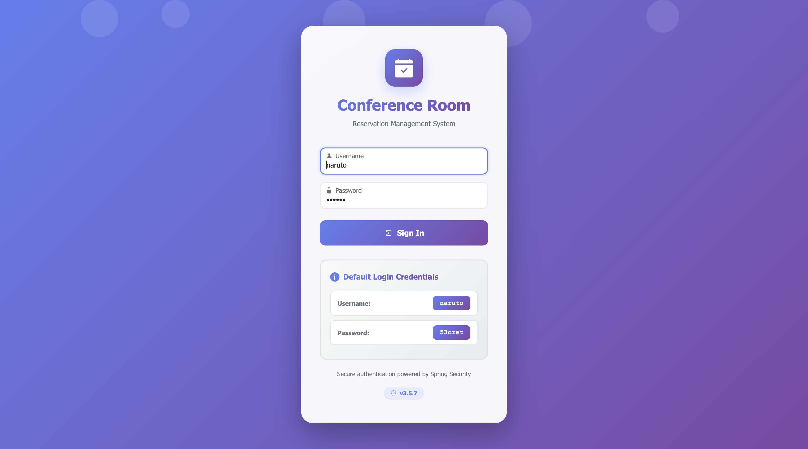
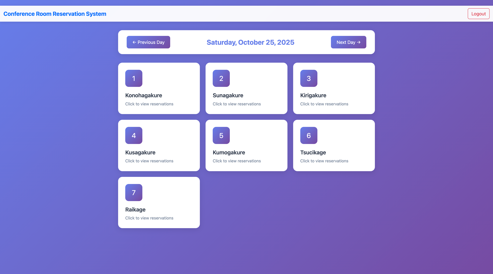
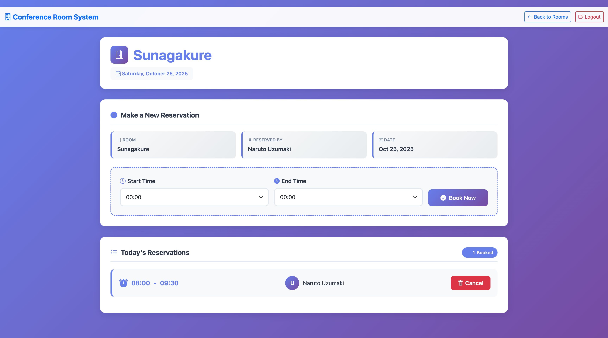

# Spring Boot Reservation System

A modern meeting room reservation system built with Spring Boot 3.5.7, PostgreSQL, Spring Security, and Thymeleaf with a
beautiful Bootstrap 5 UI.

## Features

- Modern, responsive Bootstrap 5 UI with gradient design
- Meeting room reservation management
- User authentication and authorization with Spring Security
- Role-based access control (USER and ADMIN roles)
- RESTful API endpoints
- Thymeleaf templating for server-side rendering
- PostgreSQL 17.6 database with Flyway migrations
- Docker Compose support for easy deployment
- Custom validation annotations for reservation time slots
- Time slot validation (30-minute intervals)
- Automatic database provisioning with Docker

## Technology Stack

- **Java**: 21
- **Spring Boot**: 3.5.7
- **Spring Boot Docker Compose**: For automatic container management
- **Spring Data JPA**: For database operations
- **Spring Security 6**: For authentication and authorization
- **Thymeleaf**: Template engine for web views
- **Bootstrap 5.3.3**: Modern UI framework with WebJars
- **PostgreSQL**: 17.6-alpine3.22 (Database)
- **Flyway**: Database migration tool
- **Lombok**: To reduce boilerplate code
- **Maven**: Build tool
- **Docker**: Containerization platform

## Image Screen shot

Login Page



List Rooms



Reserve Page



## Prerequisites

### Option 1: Docker (Recommended)

- JDK 21 or higher
- Maven 3.6.3 or higher
- Docker and Docker Compose

### Option 2: Manual Setup
- JDK 21 or higher
- Maven 3.6.3 or higher
- PostgreSQL 17 or higher

## Quick Start with Docker Compose (Recommended)

The easiest way to run the application is using Docker Compose, which automatically sets up PostgreSQL:

### 1. Start the Application

```bash
# Build the application
mvn clean package -DskipTests

# Run the application (Docker Compose will start automatically)
mvn spring-boot:run
```

That's it! Spring Boot will automatically:

- Start PostgreSQL 17.6 in a Docker container
- Create the database with the correct schema
- Run Flyway migrations
- Connect the application to the database

The application will start on `http://localhost:8080`

### 2. Stop the Application

```bash
# Stop the application with Ctrl+C
# Then stop and remove the containers
docker compose down

# Or stop containers but keep data
docker compose stop
```

### 3. View Running Containers

```bash
docker ps
```

## Manual Docker Compose Setup

If you prefer to manage Docker Compose manually:

```bash
# Start PostgreSQL container
docker compose up -d

# Build and run the application
mvn spring-boot:run

# Stop containers
docker compose down
```

## Database Configuration

The application uses the following database credentials (configured in `compose.yml`):

- **Host**: localhost
- **Port**: 5432
- **Database**: reservation
- **Username**: yu71
- **Password**: 53cret
- **Schema**: reservation

You can modify these in `compose.yml` and `application.properties` if needed.

## Manual Database Setup (Without Docker)

If you prefer to run PostgreSQL without Docker:

1. Install and start PostgreSQL 17 or higher

2. Create the database and user:

```bash
# Connect to PostgreSQL
psql -U postgres

# Create user and database
CREATE USER yu71 WITH PASSWORD '53cret' SUPERUSER;
CREATE DATABASE reservation OWNER yu71;

# Connect to reservation database and create schema
\c reservation
CREATE SCHEMA IF NOT EXISTS reservation;
GRANT ALL PRIVILEGES ON SCHEMA reservation TO yu71;
```

3. Update `application.properties` if you use different credentials

## Build and Run

### Option 1: Run with Maven (Recommended)

```bash
# Build the application
mvn clean package -DskipTests

# Run the application
mvn spring-boot:run
```

### Option 2: Run as JAR

```bash
# Build the application
mvn clean package -DskipTests

# Run the JAR file
java -jar target/springboot-reservation-0.0.1-SNAPSHOT.jar
```

### Option 3: Run with Docker Compose Only

```bash
# Start PostgreSQL
docker compose up -d

# Run the application
mvn spring-boot:run
```

The application will start on `http://localhost:8080`

## Default Login Credentials

Use these credentials to login to the application:

**Primary Login (Pre-filled):**

- **Username**: `naruto`
- **Password**: `53cret`

The login form is pre-filled with these credentials for quick access.

## UI Design

The application features a modern, responsive UI built with Bootstrap 5:

- **Login Page**: Beautiful gradient background with centered card layout
- **Room List**: Grid layout with hover animations and date navigation
- **Reservation Form**: Clean form design with color-coded status indicators
- **Responsive Design**: Works seamlessly on desktop, tablet, and mobile devices
- **Color Scheme**: Purple/blue gradient theme (#667eea to #764ba2)

## Available Test Users

The application comes with pre-configured test users for demonstration:

| Username   | Password   | Role  | Full Name      | Note                     |
|------------|------------|-------|----------------|--------------------------|
| **naruto** | **53cret** | USER  | Uzumaki Naruto | **Default (Pre-filled)** |
| sasuke     | password   | USER  | Uchiha Sasuke  |                          |
| sakura     | password   | USER  | Haruno Sakura  |                          |
| kakashi    | password   | ADMIN | Hatake Kakashi | Admin privileges         |

**Recommended Login**: Use `naruto` / `53cret` for fastest access (pre-filled on login form)

## Pre-configured Meeting Rooms

The system includes 7 meeting rooms:

1. Konohagakure
2. Sunagakure
3. Kirigakure
4. Kusagakure
5. Kumogakure
6. Tsucikage
7. Raikage

## API Endpoints

### Public Endpoints

- `GET /loginForm` - Login page
- `POST /login` - Login processing
- `GET /js/**` - Static JavaScript resources
- `GET /css/**` - Static CSS resources

### Authenticated Endpoints (requires login)

- `GET /rooms` - List available meeting rooms for reservation
- Room reservation endpoints (secured)

## Database Schema

The application uses Flyway for database migrations. The schema includes:

### Tables

- **users**: User accounts with authentication details
- **meeting_room**: Available meeting rooms
- **reservable_room**: Room availability by date
- **reservation**: User reservations

### Relationships

- Reservations are linked to users and reservable rooms
- Reservable rooms reference meeting rooms
- All tables use proper foreign key constraints

## Custom Validation

The application includes custom validation annotations:

- `@EndTimeMustBeAfterStartTime`: Ensures reservation end time is after start time
- `@ThirtyMinutesUnit`: Validates time slots are in 30-minute intervals

## Project Structure

```
src/main/java/com/hendisantika/springbootreservation/
├── annotation/          # Custom validation annotations
├── config/             # Spring Security configuration
├── controller/         # REST controllers
├── domain/             # JPA entities
├── exception/          # Custom exceptions
├── repository/         # Spring Data repositories
└── service/            # Business logic services

src/main/resources/
├── db/migration/       # Flyway database migrations
├── templates/          # Thymeleaf HTML templates
└── application.properties
```

## Development

### Running Tests

```bash
mvn test
```

### Code Quality

The project uses:

- Lombok for reducing boilerplate code
- Spring Boot DevTools for hot reloading during development
- JPA validation for data integrity

## Security Configuration

The application uses Spring Security 6 with:

- Form-based authentication
- BCrypt password encoding
- Method-level security annotations
- CSRF protection enabled

## Database Migration

Flyway automatically runs migrations on application startup:

1. **V1__20052019_Init_Table.sql**: Creates initial database schema
2. **V2__20052019_Insert_Data.sql**: Inserts test data and creates stored procedures

## Troubleshooting

### Database Connection Issues

If you encounter database connection errors:

1. Verify PostgreSQL is running:
   ```bash
   # Check if PostgreSQL is accepting connections
   pg_isready -h localhost -p 5432

   # Or check Docker container status
   docker ps | grep postgres
   ```

2. Check database credentials:
   ```bash
   # Connect to database inside container
   docker exec -it springboot-reservation-postgres psql -U yu71 -d reservation
   ```

3. Verify the schema exists:
   ```bash
   # List schemas
   docker exec springboot-reservation-postgres psql -U yu71 -d reservation -c "\dn"

   # List tables in reservation schema
   docker exec springboot-reservation-postgres psql -U yu71 -d reservation -c "\dt reservation.*"
   ```

4. Check Docker Compose logs:
   ```bash
   docker logs springboot-reservation-postgres
   ```

### Docker Issues

If Docker containers won't start:

1. Ensure Docker is running:
   ```bash
   docker info
   ```

2. Remove existing containers and volumes:
   ```bash
   docker compose down -v
   docker compose up -d
   ```

3. Check if port 5432 is already in use:
   ```bash
   lsof -i :5432
   ```

### Build Issues

If Lombok annotations are not working:

- Ensure your IDE has Lombok plugin installed
- Run `mvn clean compile` to regenerate sources

If Maven wrapper fails with version error:

- Use system Maven instead: `mvn` instead of `./mvnw`
- Or update the Maven wrapper version

### UI Issues

If Bootstrap styles don't load:

- Verify WebJars are properly configured in `pom.xml`
- Check browser console for 404 errors
- Clear browser cache and restart application

## License

This is a demo project for educational purposes.

## Author

- **Name**: Hendi Santika
- **Email**: hendisantika@gmail.com
- **Telegram**: @hendisantika34

## Acknowledgments

Built with Spring Boot and modern Java technologies for demonstrating enterprise application development patterns.
